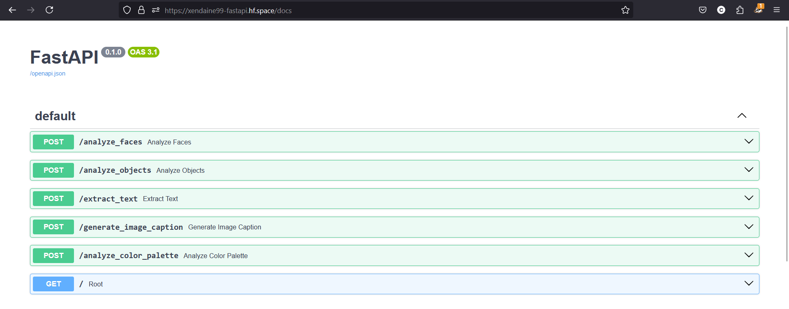

<p align="center"></p>

<p id="description">This FastAPI project provides various image analysis functionalities including face detection object detection text extraction image caption generation and color palette analysis. It utilizes libraries such as OpenCV Tesseract OCR Google Generative AI and others.</p>

<h2>🚀 Demo</h2>

[https://xendaine99-fastapi.hf.space/docs](https://xendaine99-fastapi.hf.space/docs)

<h2>Project Screenshots:</h2>



 
<h2>🧐 Features</h2>

Here're some of the project's best features:

*   POST /analyze\_faces: Analyzes faces in the uploaded image and returns the count and an image with bounding boxes around detected faces.
*   POST /analyze\_objects: Analyzes objects in the uploaded image using a model and provides descriptions for detected objects.
*   POST /extract\_text: Extracts text from the uploaded image using Tesseract OCR.
*   POST /generate\_image\_caption: Generates a detailed caption for the uploaded image using a generative model.
*   POST /analyze\_color\_palette: Analyzes the color palette of the uploaded image and provides the most dominant colors.

<h2>🛠️ Installation Steps:</h2>

<p>1. Setting Up the Environment</p>

```
python -m venv venv
```

<p>2. Activate the virtual environment (On Windows)</p>

```
venv\Scripts\activate
```

<p>3. Installing Dependencies</p>

```
pip install -r requirements.txt
```

<p>4. Running the Application locally</p>

```
uvicorn app.main:app --reload
```

<h2>🍰 Contribution Guidelines:</h2>

If you would like to contribute to this project please fork the repository and create a pull request with your changes. Ensure your code follows the project's coding standards and includes appropriate tests.

  
<h2>🛡️ License:</h2>

This project is licensed under the MIT